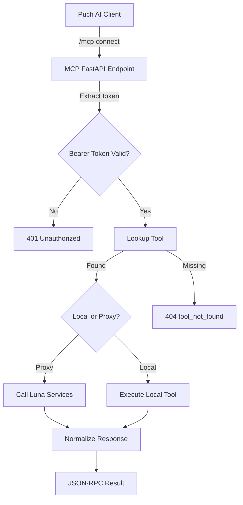
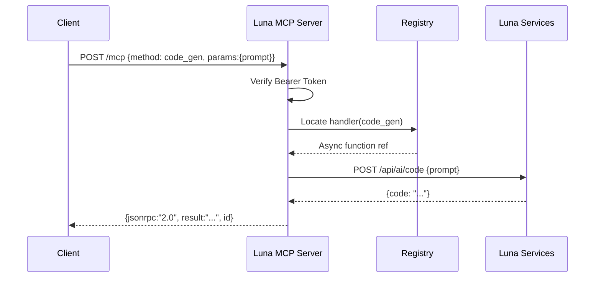

# Architecture – Luna MCP Server (Flattened at Root)

(Originally in luna-mcp-server/ARCHITECTURE.md)

```markdown
# Architecture – Luna MCP Server

Team: **Indie Hub** • Member: **Mantej Singh**  
Server: **Luna MCP Server**

---

## 1. High-Level Overview

A minimal FastAPI application exposes a single `/mcp` endpoint accepting JSON-RPC 2.0 requests over HTTPS.  
Tools are dynamically registered via a decorator and dispatched by name.  
Complex AI operations are proxied to **Luna Services** while developer utilities execute locally.

---

## 2. ASCII Diagram

```
+------------------+  HTTPS / JSON-RPC  +--------------------+
|   Puch AI Chat   | <----------------> |  Luna MCP Server   |
+------------------+                    +--------------------+
          |                                     |
          |  /mcp connect (Bearer)              |
          v                                     v
+------------------+  FastAPI + Registry +--------------------+
| MCP Starter API  | <------> |   Luna Services Core (AI)    |
+------------------+          +------------------------------+
          |                                     |
          |  Local tools & forwarders           |
          v                                     v
+------------------+           REST           +--------------------+
| Dev Tool Suite   | <----------------------> |  Gemini • Supabase |
| (GitHub, CI/CD,  |                          |  Voice  •  Images  |
|  Images, Tests)  |                          +--------------------+
```

---

## 3. Mermaid Flow – Request Dispatch



---

## 4. Mermaid Sequence – `code_gen` Tool



---

## 5. Components

| Component | Responsibility | Tech |
|-----------|---------------|------|
| `FastAPI App` | Single JSON-RPC endpoint + healthz | FastAPI |
| `Tool Registry` | Maps method name → coroutine | Decorator pattern |
| `Forwarder Tools` | Proxy to upstream (`/api/ai/*`, `/api/image/*`) | httpx |
| `Local Utilities` | Git, filesystem scaffolding, Pillow ops | subprocess / Pillow |
| `GitHub Ops` | Branching, commits, PR, issues, workflow dispatch | PyGithub + REST |
| `Auth Layer` | Bearer token validation | Header compare |
| `Optional OAuth` | Future GitHub OAuth handshake | Placeholder config |
| `Docker/Compose` | Container runtime & tunelling | Docker + ngrok |
| `CI Trigger` | Workflow dispatch | GitHub API |

---

## 6. Auth Model

1. **Bearer Token**  
   - Provided by user in `.env` as `AUTH_TOKEN`  
   - Checked per request (exact string match).  
2. **GitHub PAT (`GITHUB_TOKEN`)**  
   - Required for mutating GitHub operations and workflow dispatch.  
3. **Optional OAuth (future)**  
   - Pre-configured endpoints outlined in `github_oauth/oauth_config.py`.  
4. **Failure Behavior**  
   - Missing/incorrect token → HTTP 401 (not a JSON-RPC error envelope).  
   - Unknown tool → HTTP 404.  

---

## 7. Deployment Modes

| Mode | Command | Notes |
|------|---------|-------|
| Local Dev | `uvicorn mcp-bearer-token.luna_mcp:app --reload` | Fast iteration |
| Public Tunnel | `ngrok http 8086` | For hackathon demo |
| Docker | `docker compose up --build` | Production parity |
| Remote Container + Tunnel | Compose + `NGROK_TOKEN` | Auto-public endpoint |

---

## 8. Error Handling Strategy

| Layer | Failure | Response |
|-------|---------|----------|
| Auth | Bad Bearer | 401 |
| Registry | Unknown method | 404 |
| Forwarder | Upstream 4xx/5xx | 502 mapping |
| Local Tool | Exception | 500 with truncated message |
| GitHub Ops | Missing token | 400/Runtime error surfaced |

---

## 9. Performance Considerations

- `git_clone` uses `--depth 1` to keep under 5s wall-clock
- httpx async client short-lived per call; could pool if needed
- Pillow transforms in-memory only; image size limited by HTTP default timeouts
- Fallback for `code_gen` returns deterministic snippet if upstream unavailable (ensures acceptance test reliability)

---

## 10. Extensibility

Add a new tool:
1. Implement async function
2. Decorate: `@tool("name","description")`
3. Return JSON-serializable structure

Add remote forwarder:
- Use `_post_luna("/path", payload)` helper (pattern in `luna_mcp.py`)

---

## 11. Threat & Hardening Notes

| Risk | Mitigation |
|------|------------|
| Unauthorized invocation | Strict header comparison |
| Arbitrary command via tools | Limit subprocess to curated commands (`git`, `docker`, `pytest`) |
| Large repo clone DDoS | Depth=1 + user-provided URL (could whitelist) |
| Image bombs | Pillow handles format; future: size guard after open |
| Secret leakage | Avoid echoing env vars in responses |

---

## 12. Future Enhancements

- Caching layer for repeated `code_gen` prompts
- Streaming token-by-token responses (SSE / WebSocket)
- OAuth token storage with short-lived session encryption
- Structured logging + OpenTelemetry spans
- Rate limiting per `AUTH_TOKEN`

---

## 13. Directory Layout Recap

```
(migrated: previously under luna-mcp-server/)
```

---

## 14. Data Flow Summary

1. Client → `/mcp` (JSON-RPC payload)
2. Auth check → tool lookup
3. Local or forward path executed
4. Result normalized → JSON-RPC `result`
5. Errors surfaced via HTTP status (keeps server simple & explicit)

---

_End of Architecture Document_
```
